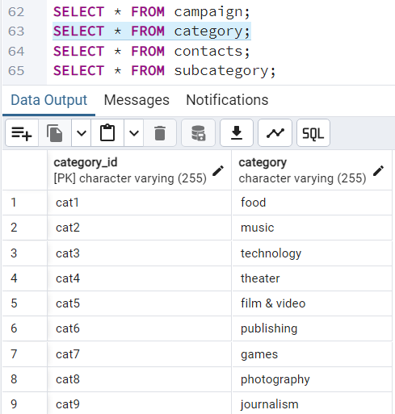
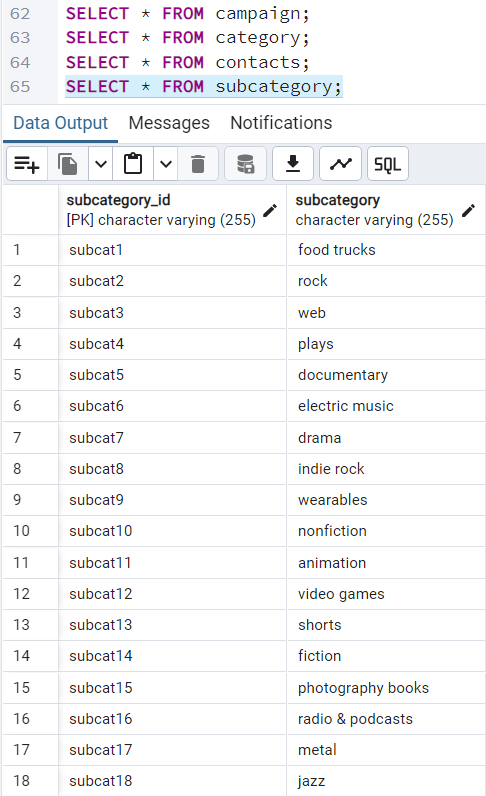
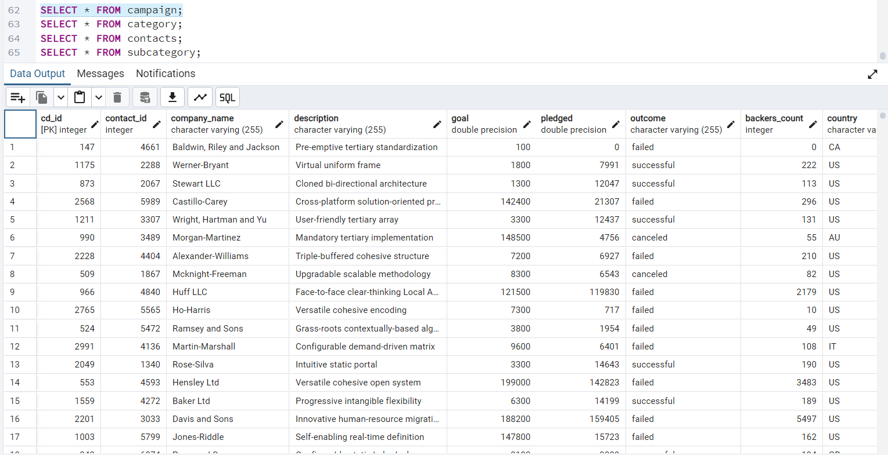
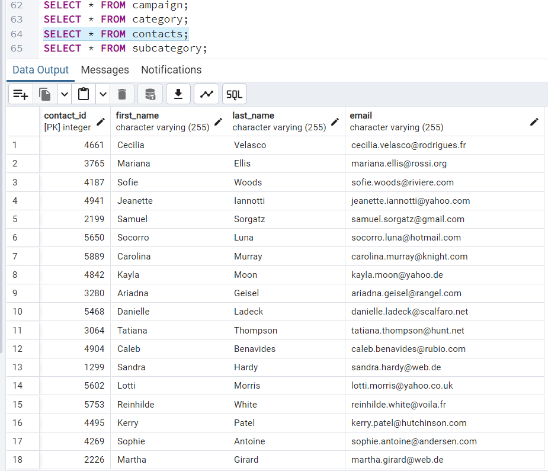
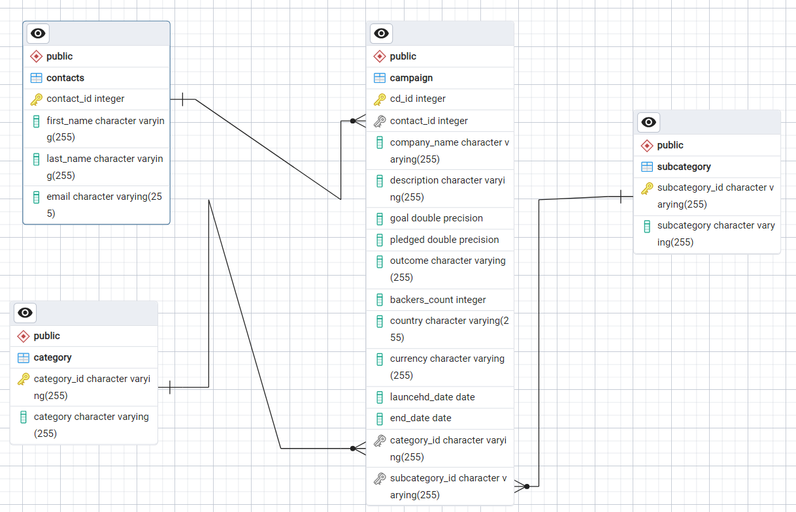
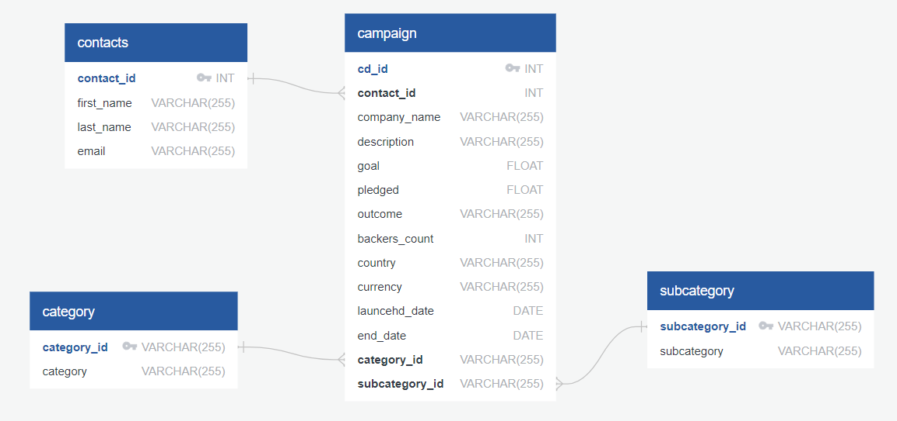

# Crowdfunding_ETL
Columbia University Bootcamp Project 2
Crowdfunding ETL

## Crowdfunding

The Crowdfunding file illustrates the data obtained from various companies that have taken part in crowdfunding, there are those that have been able to succeed and those that were not able to obtain funding successfully. 

The code presented illustrates the different data frames to better discern the various subjects of information to be able to know if it is beneficial for a company to attempt crowdfunding and or to identify the possible reasons that it was able to succeed and or if not fail in other cases.

## Crowdfunding Dataframe

The Crowdfunding database is taken into the Pandas library and exported to be able to organize the data, to then have it within the SQL and Postgres SQL to give a better visual representation of the connections within the Crowdfunding database and the data frames that were established. 

With the use of SQL, it is to display a generalized view of the relationships that are within the Crowdfunding file. 

Within the Postgres SQL, it illustrates an in-depth visualization of the stored data pertaining to Crowdfunding and process the connections that are there regarding the different pieces of data that are provided for the different companies. 

## Category and Subcategory DataFrames

The purpose of this is to be able to organize the data and to be able to provide clarity regarding the many companies within the database. 

This is to assist the reader in gaining understanding that many companies may fall within the same category but, can differ do to pertaining to different subcategories that help it to discern itself from others.

    

    

## Campaign DataFrame

This data frame was established to better discern all the information pertaining to the overall Crowdfunding file. 

Overall, this is to note all the important details of each company that took part in the Crowdfunding such as the company names, descriptions, overall financial funding(goal/pledge/outcome), the countries, the currency, as well the dates that it was launched and the end date of the Crowdfunding.

    

## Contacts DataFrame

This is established to organize the data to assist the viewer in discerning the identifiers of the people via the internet that were able to provide funding for the various companies.

This can be utilized to be able to reach out to the individual as a thank you and possibly to confirm the identity of a person and know if it is fraudulent.

    

## Crowdfunding Database (SQL/PostgresSQL)

This was established to provide an overview of the information obtained in an organized manner.

This displays a visual aid to provide connections that are consistent with the data such as the contact information, the category and subcategory that can be found within the campaign data frame. 

    

    

# Abstract
## What is Crowdfunding and the purpose of this? 

That is a great question to ask and something that may assist you in your business endeavors in the future.

Crowdfunding is the overall practice of obtaining funding for a venture or a project in which it is possible to do this through the help of the internet and this can reach either a small number or large number of people.

This is an alternative option then having to go through the traditional route of meeting with potential investors in person and or get a loan from a bank. 

Crowdfunding is a form of fundraising that is advantageous to small businesses and entrepreneurs to be able to connect with people that are aligned to a company's ethos. 

Overall, the purpose and significance of having this information at one's fingertips is to be able to take note of the many similarities and differences that can contribute to the success and if not failure that companies all over the world have encountered.

The use of the Pandas library is to assist with organizing the data and to then export the data to SQL/ Postgres SQL is to have a visual aid to illustrate the information in a manner that can be easily digested by individuals that can benefit from this information.

In the end, Crowdfunding can bring about many benefits to obtain funding for a project/venture; this information is useful not only to those that have attempted this method but also to those that are thinking about venturing to do this. 

